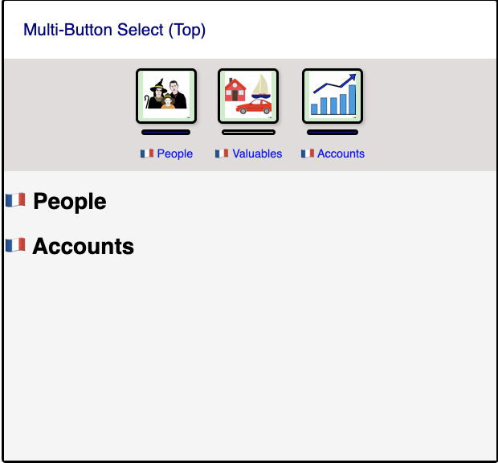

## The Hydration Issue

I have a mostly working control that accepts a collection of (_button_image_,
_content_view_) pairs and allows the associated views to be displayed by
clicking the buttons. The idea is a toolbar with image buttons representing
_content_views_ and all those associated _content_views_ are present, they just
may be hidden. The point of this component is to allow easy saving of space. 




<video width="400"  controls>
  <source src="multi_button.mov" type="video/mp4">
</video>

---

I believe this is working as intended, but it has hydration issues flagged at
startup. I would like to know how others track down the offending code when
 dealing with hydration issues. Originally I implemented the _content_views_
using `<Show ..>` and [asked the discord
group](https://discord.com/channels/1031524867910148188/1172609645102239744/1172623431154532462)
and got some good feedback. According to `gbj`:

> Yes, I would expect creating views that you do not use initially to cause
> hydration issues in the current version


One piece of advice he gave:

> I would suggest that rather than storing views in signals, you should store
> data in signals, and render views declaratively when you need them

The first part sounds reasonable, however, I don't think I was storing views in
signals. But, I was creating views and storing them in structs and passing
them into a component in a non-declarative (non-leptos??) way. This
component is challenging for me to think like leptos encourages because the
container component (`MultiButtonSelect`) has _n_ pairs of views. In the picture
there are 3 pairs of views:

- People Button (with underline decoration indicating state) and its associated view (Just the
  `<h3>People</h3>` here)
- Valuables Button and its associated view
- Accounts Button and its associated view

The `MultiButtonSelect` needs to gather and group the _button_views_ into the
toolbar and gather and group the associated _content_views_ into a main
container. This makes it difficult (for me) to define or even think of
a declaration of leptos components because of the need to split apart the
button from its associated view.

This version that has hydration issues has two leptos components and a few
support structs: The `MultiButtonSelect` is the main container component and is
provided the paired data as a `MultiButtonData` struct.

```rust
#[component]
pub fn MultiButtonSelect(
    /// The buttons data to display in the managed toolbar
    button_data: Vec<MultiButtonData>,
    /// Side of view the buttons appear.
    /// Top and bottom orient buttons horizontally.
    /// Left and right orient buttons vertically.
    button_bar_side: ViewSide,
) -> impl IntoView
```

The view of the button is pulled from the `image_ref` string and the associated
content _content_view_ is a member of `MultiButtonData` and thus effectively the
pair of views.

```rust
#[derive(Debug, Default, Clone)]
pub struct ButtonSelection {
    /// Reference to the image
    pub image_ref: String,
    /// Label for the button
    pub label: String,
    /// The toggle state of the button
    pub toggle_state: ToggleState,
}

#[derive(Debug, Clone, Default)]
pub struct MultiButtonData {
    /// The image and state of the button
    pub button_selection: ButtonSelection,
    /// The view to display when the button is _selected_.
    pub view: View,
}
```

The views in the toolbar that the `MultiButtonData` creates are
`ToggleImageButton` instances which put the button image in a div and put a div
under it to indicate the selected vs not selected state.

```rust
#[component]
pub fn ToggleImageButton(
    /// Models the button to display and contains the state
    updatable: Updatable<ButtonSelection>,
) -> impl IntoView
```

The `MultiButtonSelect` needs to iterate over the _pairs_ of view data and
collect the buttons into a toolbar and the content views into its separate
container view. Here is how I did that:

```rust
    let (button_views, content_views): (Vec<_>, Vec<_>) = button_data
        .into_iter()
        .enumerate()
        .map(|(i, mut button_data)| {
            use std::mem::swap;
            let mut displayed_view = ().into_view();
            swap(&mut displayed_view, &mut button_data.view);
            let mut button_selection = ButtonSelection::default();
            swap(&mut button_selection, &mut button_data.button_selection);

            let content_view = view! {
                // CREATE THE CONTENT VIEW THAT WILL OPTIONALLY BE SHOWN
            }
            .into_view();

            let button_view = view! {
                // CREATE THE `ToggleImageButton` for the toolbar
            }
            .into_view();

            (button_view, content_view)
        })
        .unzip();
```

> It is funny to me that `@gbj` flagged those `swap` lines with a _huh?_, as in
> _wtf are you doing_ :-). To me it made sense at the time - I have to pull the
> view out of the button_data for each provided. I could just clone it but I
> have no idea how much is in those content views. So those lines are swapping
> an empty view into the client provided button_data to get ownership of the
> real views out without a clone. What is funny to me is that he is looking at
> my code with a kind of understandable _wtf_ and that is exactly how I viewed
> almost all of leptos when I started. Of course, my leptos _wtf's_ were out of
> ignorance and I'm just beginning to appreciate the patterns. His _wtf_
> indicates I'm likely thinking about it wrong. I'd love to know in this case
> when I went off the rails. My suspicion is as soon as I started thinking about
> creating _content_views_ up front, outside of a `view!` macro, then I was
> straying from the path.
> 

Originally I was using `<Show...>` for the `content_view`:

```rust
let content_view = view! {
    <Show when=move || button_view_is_shown(i) fallback=|| ()>
        {displayed_view.clone()}
    </Show>
}
.into_view();
```

Somehow this is the thing that is creating the hydration issue. My best
guess is when this is run on the server and the `button_view_is_shown(i)` is
called, if the value is false the inner content of the show is empty and that
messes with the attempt to rehydrate on the client side leading to hydration
errors. The suggestion `gbj` was:

> Can the client provide a function/closure, which can be called to create the
> view lazily when needed?

That makes sense and it is how I solved it. But before that, I figured I'd see
if the issue was somehow in the use of `<Show...>`. Maybe if I created a show
that behaved a bit differently I could make the hydration issue go away. I
created a `CssShow` which the idea is to do like _leptos_ `<Show...>`, but just
use css `display: none;` as a way to hide it. Then the div would still be there
on the server and on the client and it should match things up fine.

```rust
#[component]
pub fn CssShow(
    /// The children will be shown whenever the condition in the `when` closure returns `true`
    children: ChildrenFn,
    /// Value controlling the display hidden vs not state.
    #[prop(default=MaybeSignal::Static(true), into)]
    when: MaybeSignal<bool>,
    /// Style display type when not hidden
    display_type: String,
) -> impl IntoView {
    crate::log_component!("`CssShow`");
    use leptos::SignalGet;
    let style = move || {
        if when.get() {
            format!("display: {display_type}")
        } else {
            "display: none;".to_string()
        }
    };

    view! {
          <div style=style>{children}</div> 
    }
}
```

> I would love someone knowledgeable to discuss the tradeoffs of `CssShow`
> approach vs the leptos `Show`. Somehow I feel the css version is doing less
> on the toggling - because this leptos implementation looks like it is doing more
> work when the `when` state is toggled. `children().into_view()` looks like it
> could be expensive - but I just don't know:

```rust
    let memoized_when = create_memo(move |_| when());

    move || match memoized_when.get() {
        true => children().into_view(),
        false => fallback.run(),
    }
```

Anyway, the `CssShow` did not help the hydration issue at all.

## Addressing The Hydration Issue

I've changed the approach to not pass in pre-created _content_views_, but rather
take the suggestion of creating the view _lazily_. I'm not convinced I'm really
creating it lazily per the suggestion but at least I am not creating it up
front. Originally I was pairing up the _button_view_ and _content_view_ in a
struct like this and then passing a vec of those into `MultiButtonSelect`.

```rust
 MultiButtonData::new(
    ButtonSelection::new(
        "worths_button.png".into(),
        valuables_lbl.clone(),
        ToggleState::Deselected,
    ),
    view! {
            <div>
            <h1>{valuables_lbl}</h1>
            </div>
    }
    .into_view(),
)
```

To avoid that upfront _content_view_ creation the component now has this
signature, pushing the creation of the _content_views_ into the
`MultiButtonSelect`.

```rust
#[component]
pub fn MultiButtonSelect<CM>(
    /// Initial display state for each button. Determines the number of buttons and views.
    button_selections: Vec<ButtonSelection>,
    /// Creates the content view for entry `i`
    content_maker: CM,
    /// Side of view the buttons appear.
    /// Top and bottom orient buttons horizontally.
    /// Left and right orient buttons vertically.
    button_bar_side: ViewSide,
) -> impl IntoView
where
    CM: Fn(usize) -> View + Clone + 'static
```

The creation of the _button_views_ is not that different than before. Just
iterate over the `button_selections` and create the `<ToggleImageButton...>`
views. This now works without hydration issues. But it is kind of ugly for the
user of the `MultiButtonSelect`. Maybe there are cleaner ways to associate the
_button_view_ with its _content_view_ besides relying on the index?

```rust
let button_selections = vec![
    ButtonSelection::new(
        "persons_button.png".into(),
        prefix_lang("People"),
        ToggleState::Selected,
    ),
    ButtonSelection::new(
        "worths_button.png".into(),
        prefix_lang("Valuables"),
        ToggleState::Deselected,
    ),
    ButtonSelection::new(
        "accounts_button.png".into(),
        prefix_lang("Accounts"),
        ToggleState::Selected,
    ),
];

let content_maker = move |i| match i {
    0 => view! {
        <div>
            <h1>{prefix_lang("People")}</h1>
        </div>
    }
    .into_view(),
    1 => view! {
        <div>
            <label>
                {prefix_lang("Valuables")}
            </label>
        </div>
    }
    .into_view(),
    2 => {
        view! {
            <div>
                <h1>{prefix_lang("Accounts")}</h1>
            </div>
        }
        .into_view()
    }
    _ => panic!("Invalid view index"),
};

view! {
    <div class="title">{move || format!("Multi-Button Select ({side:?})")}</div>
    <MultiButtonSelect
        button_selections
        content_maker
        button_bar_side=side
    />
}
.into_view()
```

The trickiest part was finding a way to call the `content_maker` function passed
in multiple times in a loop. I tried all sorts of ways to iterate over the
selections and for each one call `content_maker(i)`. But all straightforward
approaches I was trying was rejected by the borrow checker. Finally I gave up on
that approach and put that `content_maker` into leptos with `store_value` and
then accessed the function from there. Is this normal or are there easier ways
without putting it in the store?

```rust

    let content_maker_stored_value = store_value(content_maker);

    let content_views = (0..button_count)
        .into_iter()
        .map(|i| {
            view! {
                <CssShow
                    when=Signal::derive(move || button_view_is_shown(i))
                    display_type="block".into()
                >
                    {move || {
                        content_maker_stored_value.with_value(|content_maker| content_maker(i))
                    }}

                </CssShow>
            }
        })
        .collect::<Vec<_>>();
```